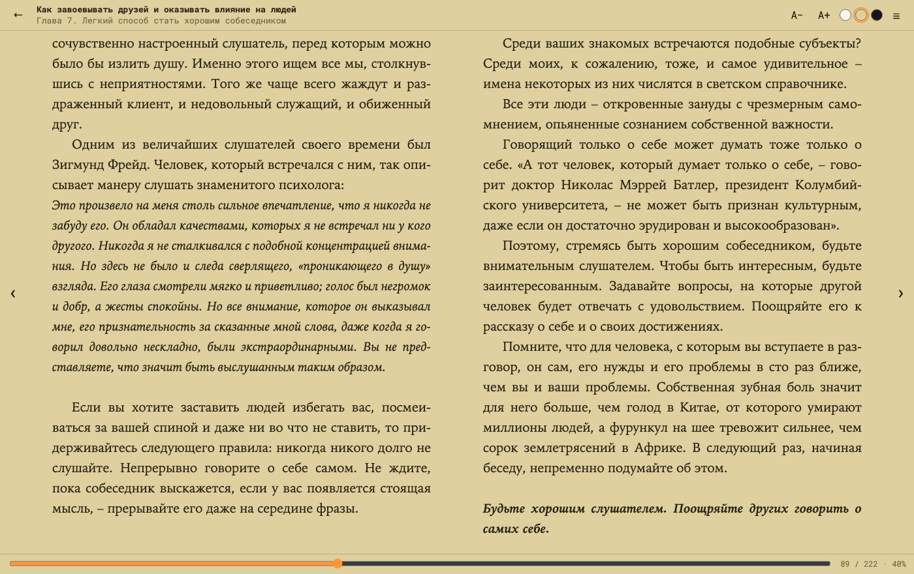
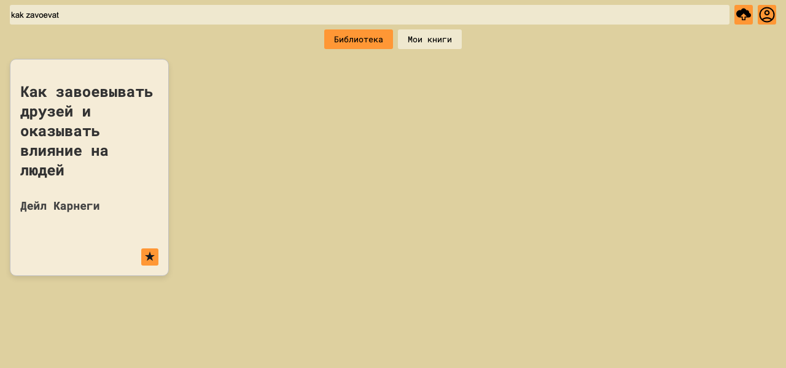
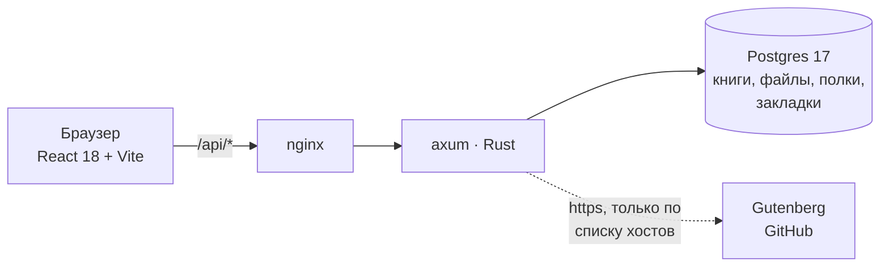

<h1 align="center">Leser</h1>

<p align="center">
  <b>Онлайн-библиотека для чтения книг.</b><br>
  Общий каталог, своя полка, читалка на все форматы — и место в книге,
  которое живёт на сервере, а не в браузере.
</p>

<p align="center">
  <a href="https://github.com/Karavang/Leser/actions/workflows/ci.yml"></a>
  
  
  
  
</p>

<p align="center">
  
</p>

## Что это

Личная библиотека, которую поднимают одной командой и читают с любого
устройства. Всё — и книги, и место в каждой из них — привязано к аккаунту
и лежит в Postgres, а не в браузере: войдя с телефона, вы получаете и свою
полку, и страницу, на которой остановились на ноутбуке.

Три вещи, ради которых это писалось:

- **Читать должно быть приятно.** Читалка своя, одна на все форматы: страницы,
  а не бесконечная прокрутка, разворот на широком экране, переносы по языку
  книги, оглавление и рабочие ссылки внутри текста.
- **Найти книгу должно быть легко.** Поиск переживает чужую раскладку,
  латиницу вместо кириллицы, опечатки и неправильную словоформу.
- **Библиотека общая, полка своя.** Каталог один на всех, но каждый читатель
  сам решает, что у него в «Моих книгах».

Проект некоммерческий и делается для себя — отсюда и решения: ноль внешних
сервисов, вся библиотека в одной базе, разворачивается на любом сервере,
где есть Docker.

## Возможности

### Читалка

Одна на все форматы: `epub`, `fb2`, `mobi`, `azw3`, `pdf`, `txt`, `md` и `html`
открываются одинаково, потому что формат разбирает сервер, а не браузер.

Страницы верстает сам браузер: текст разложен в колонки высотой в экран,
«перелистнуть» — это прокрутить ровно на ширину окна. Отсюда честные страницы
с целыми строками и разворот из двух колонок на широком экране.

| | |
|---|---|
| темы | день, сепия, ночь |
| шрифт | семь размеров, запоминается |
| навигация | стрелки, пробел, Home/End, два пальца по тачпаду, свайп, кнопки по краям, полоса по книге |
| оглавление | главы с отметкой текущей |
| ссылки | оглавление в аннотации и сноски работают, с кнопкой «назад» |
| переносы | по языку книги — иначе узкая колонка рвётся пробелами |
| закладка | на сервере, а не в браузере; доля прочитанного, а не номер страницы — смена шрифта её не сбивает |

### Поиск

<p align="center"></p>

Ищет по названию, автору и серии сразу. Пять слоёв, каждый закрывает то,
что не умеет предыдущий:

| слой | что чинит | пример |
|---|---|---|
| разбиение на слова | слово из названия и слово из автора лежат в разных полях | `карнеги друзей` |
| `ilike` | регистр в любом языке — свёртку даёт коллация базы | `ГАРРИ`, `PRATCHETT`, `MANTOLU` |
| транслитерация | русское название, набранное латиницей | `kak zavoevat` |
| раскладка, оба направления | забыли переключить язык | `rfhytub` → Карнеги |
| триграммы | словоформы и опечатки | `завоевать` ≈ `завоевывать`, `гари потер` |

Сравнение делает Postgres (`pg_trgm`), разбор запроса — Rust. Подробности
и почему стеммер тут не помог — в [api/README.md](api/README.md#поиск).

### Мои книги

<p align="center"></p>

Каталог общий, полка личная: любую книгу можно отложить себе звёздочкой
и убрать обратно. Загруженная ложится на полку сама.

Убрать с полки — не то же самое, что удалить: книга остаётся в библиотеке.
Удалить может только тот, кто её принёс, или админ.

### Язык интерфейса

Русский и английский. Язык берётся из браузера: не русский — значит английский.
Переключается в профиле, в настройках, и запоминается на устройстве.

Словарь — `frontend/src/i18n.js`, обе версии в одном файле; библиотеки нет,
на два языка без склонений её незачем ставить. Сервер отвечает на том же языке:
фронт шлёт его заголовком `X-Lang`, и каждое сообщение об ошибке хранится
на обоих — [как это устроено](api/README.md#язык-ошибок).

### Темы

День, сепия и ночь — одна тема на приложение и читалку. Переключается кружками
в шапке читалки и в настройках профиля, помнится на устройстве.

Цвета — переменные в `:root`, класс темы висит на `<html>`. Поэтому
переключение это одна строка и никакой перерисовки: `frontend/src/theme.js`.

### Книги извне

Если книги нет в библиотеке, поиск идёт дальше — в
[Project Gutenberg](https://gutenberg.org) и на GitHub (нужен `GITHUB_TOKEN`).
Найденное можно забрать к себе одной кнопкой: файл скачивается, разбирается
и ложится в библиотеку по тем же правилам, что и загруженный с диска.

В графе «Источник» у таких книг остаётся ссылка на то место, откуда книга взята.

### Форматы

| | |
|---|---|
| `epub` | распаковка и разбор XHTML на сервере |
| `fb2` | включая картинки в `<binary>` и сноски |
| `mobi`, `azw3` | Kindle без DRM: свой разбор контейнера и распаковка |
| `pdf` | текст достаётся и **верстается заново** — иначе на телефоне только масштабировать |
| `txt` | абзацы по пустым строкам, главы по виду строки; windows-1251 читается наравне с utf-8 |
| `md`, `html` | целиком, вместе со списками, таблицами и кодом |
| `.rda` | данные R; на GitHub книги нередко лежат так. Конвертируются в fb2 при загрузке — [как и почему](api/README.md#rda--книги-из-r) |

Читалка на фронте про этот список не знает ничего: любой формат сервер сводит
к одному документу, и открываются они одинаково.

Книга разбирается **один раз, при загрузке**: библиотека только пополняется,
файл не меняется, и распаковывать zip на каждое открытие незачем.

Чего нет: **DjVu** — это сканы, текстовый слой лежит под собственным
сжатием, и без системного djvulibre из них не достать даже его. **KFX** —
закрытый формат Amazon, в живой природе всегда под DRM. DRM библиотека
не снимает: защищённый файл честно не откроется.

## Быстрый старт

```sh
git clone https://github.com/Karavang/Leser.git && cd Leser
cp .env.example .env
openssl rand -hex 32          # результат — в JWT_SECRET в .env
docker compose up --build
```

Библиотека на **http://localhost:8081**. Postgres поднимется рядом, миграции
применятся сами при старте API. Регистрация — на странице входа.

Админ (может удалять чужие книги) назначается в базе — отдельной страницы
для этого нет намеренно:

```sh
docker compose exec db psql -U leser -d leser \
  -c "update users set is_admin = true where email = 'вы@example.com'"
```

Чтобы включить поиск по GitHub, добавьте в `.env` токен — прав ему не нужно
никаких, `/search/code` просто требует аутентификации:

```sh
GITHUB_TOKEN=ghp_...
```

Без него источник просто выключается, остальное работает.

## Как устроено



| каталог | |
|---|---|
| [`api/`](api/README.md) | бэкенд: Rust (axum) + Postgres. Файлы книг тоже в Postgres |
| `frontend/` | React + Vite, раздаётся nginx'ом |
| `deploy/` | конфиг nginx прод-сервера |
| `.github/` | CI |

Фронт зовёт бэкенд по относительному `/api/*` — один origin, CORS не участвует.
Для `npm run dev` (порт 5173) то же делает vite-прокси, цель переопределяется
через `VITE_API_TARGET`.

### Почему так

**Разбор формата — на сервере.** Иначе на каждый формат нужна своя читалка,
а под epub ещё и распаковка zip в браузере. Сервер сводит epub и fb2 к одному
документу с готовой разметкой — и читалка на фронте одна, про форматы
не знающая вовсе. Заодно из бандла уехал epub.js: 688 → 323 КБ.

**Файлы книг в Postgres, а не в S3.** Библиотека личная, книг сотни, а не
миллионы. Зато загрузка книги — одна транзакция: строки без файла и файла
без строки не бывает по построению.

**Поиск на Rust + Postgres.** Разбор запроса (раскладки, транслитерация) —
это работа со строками, где Rust на месте; сравнение и триграммы отдаются базе,
которая это умеет лучше.

### Адреса

| путь | что |
|---|---|
| `/` | библиотека |
| `/login` | вход и регистрация |
| `/me` | профиль, настройки, удаление аккаунта |
| `/book/{uuid}.{ext}` | читалка |

Всё, кроме `/login`, за проверкой токена: нет токена — переход на `/login`.

### API

Полная таблица эндпоинтов, схема базы и разбор форматов — в
**[api/README.md](api/README.md)**. Коротко:

```
GET    /getAll?q=          книги, с поиском
GET    /read/{id}.{ext}    книга для читалки: главы с разметкой, любой формат
POST   /putNewOne          загрузка файла (multipart, до 64 МБ)
POST   /myBooks/{file}     отложить себе        DELETE — убрать
POST   /pageWasFlipped     закладка
GET    /searchSources?q=   поиск по внешним источникам
POST   /import             забрать книгу из источника
```

Аутентификация — JWT в `Authorization: Bearer`, пароли под argon2.

### Безопасность

Не «на всякий случай», а по построению — файлы приходят от кого угодно:

- **SQL-инъекций нет структурно**: sqlx отправляет значения отдельно от текста
  запроса. Название вида `Robert'); DROP TABLE books;--` просто сохранится
  как название.
- **Разметка для читалки собирается сервером** из фиксированного набора тегов;
  весь текст экранируется, `<script>` и чужие атрибуты выбрасываются вместе
  с содержимым. Проверяется тестом `hostile_markup_is_neutralised`. Через тот же
  разбор идут и `html` с `markdown` — сырой html в них тоже чужой файл.
- **Загруженный `.html` не отдаётся как `text/html`**: иначе он выполнился бы
  как страница на нашем же origin. Скачивание книги — это скачивание.
- **Метаданные чистятся** до записи в базу: `\0`, управляющие символы,
  символы разворота текста (`U+202E`), потолки на длину полей.
- **Защита от SSRF**: скачивание по ссылке от клиента ходит только по `https`
  и только на хосты из списка, причём проверяется каждый переход по редиректу.

## Разработка

```sh
docker compose up -d db          # только база
cd api      && cargo run         # бэкенд с переменными из ../.env
cd frontend && npm ci && npm run dev
```

Проверки — те же, что гоняет CI на каждый push и PR:

```sh
cd api      && cargo fmt --check && cargo clippy --all-targets -- -D warnings && cargo test
cd frontend && npm run lint && npm run build
docker compose build
```

Образы многостадийные: в рантайм едет только результат сборки — у API один
бинарник на distroless (ни shell, ни cargo), у фронта `dist` на nginx.

Что сделано и что **осознанно не делается** — в [TODO.md](TODO.md). Решения,
принятые «пока хватит и так», помечены в коде комментарием `ponytail:` вместе
с потолком и путём наверх:

```rust
// ponytail: пагинации нет — на текущей библиотеке это один скан.
// Появится тысяча книг — limit/offset и trigram-индекс из 0002.
```

## Вклад

Баг-репорты, идеи и патчи — через
[issues](https://github.com/Karavang/Leser/issues) и pull request'ы.
Перед PR прочитайте [CONTRIBUTING.md](CONTRIBUTING.md): там про стиль,
проверки и про то, на каких условиях принимается код.

## Лицензия

[AGPL-3.0](LICENSE) © Karavang.

Пользоваться, изучать, менять и распространять — можно, в том числе на своём
сервере. Условие одно: если вы поднимаете изменённую копию как сервис,
исходники изменений должны быть доступны его пользователям.

Авторские права на проект принадлежат автору, поэтому **на отдельные модули
может действовать коммерческая лицензия**: платные возможности, если они
появятся, будут лежать в отдельном каталоге со своей лицензией, а ядро
останется под AGPL. За коммерческой лицензией или снятием требований AGPL —
через issues.

Книги, попадающие в библиотеку, лицензией проекта не покрываются: за то, что
вы загружаете и откуда забираете, отвечаете вы. Gutenberg — общественное
достояние, всё остальное на вашей совести.
